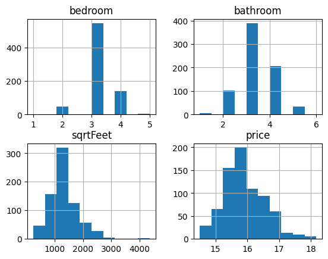
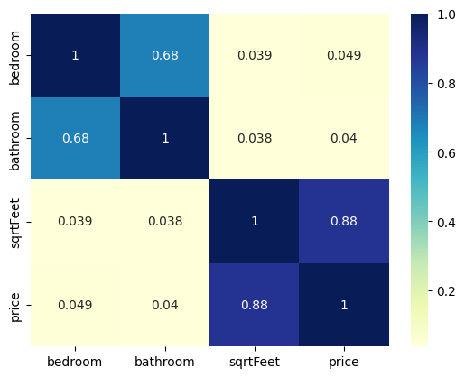

# House Price Prediction 🏠📊

**Simple exploratory script** for analyzing and visualizing a house prices dataset.

## Overview
- Reads `house_price_bd.csv` using **pandas**
- Performs basic cleaning (drop missing values and irrelevant columns)
- Splits data into train/test sets using **scikit-learn**
- Generates a **correlation heatmap** and **feature histograms** (price is log-transformed for visualization)

## Features ✅
- Quick EDA and visualization (heatmap + histograms)
- Data cleaning steps visible in `house_price_prediction.py`
- Uses standard data science stack (`numpy`, `pandas`, `seaborn`, `matplotlib`, `scikit-learn`)

## Requirements 🔧
Install dependencies (recommended in a virtualenv):

```bash
python -m venv venv
venv\Scripts\activate    # Windows
pip install -r requirements.txt
```

## Usage ▶️
Run the script with:

```bash
python house_price_prediction.py
```

This will load `house_price_bd.csv`, print dataset info to console, and display the heatmap and histograms.

## Notes & Suggestions 💡
- The script currently calls `dropna(inplace=True)` and removes these columns: `title`, `block/sector`, `city/area`.
- Price is transformed with `np.log(price + 1)` for plotting.
- For reproducible splits, consider adding `random_state=<int>` to `train_test_split()`.
- The script displays plots interactively; add `plt.savefig()` calls if you want to persist figures.

## Demo Screenshots 📷
### Histograms


### Correlation heatmap



